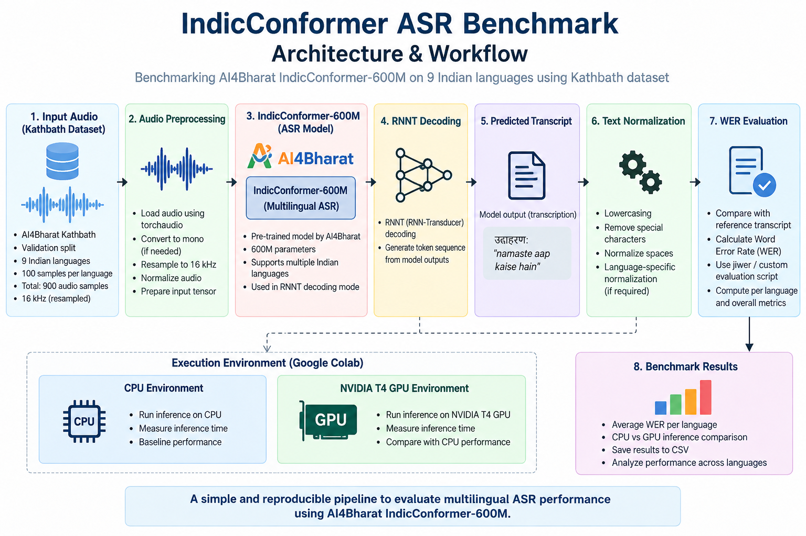
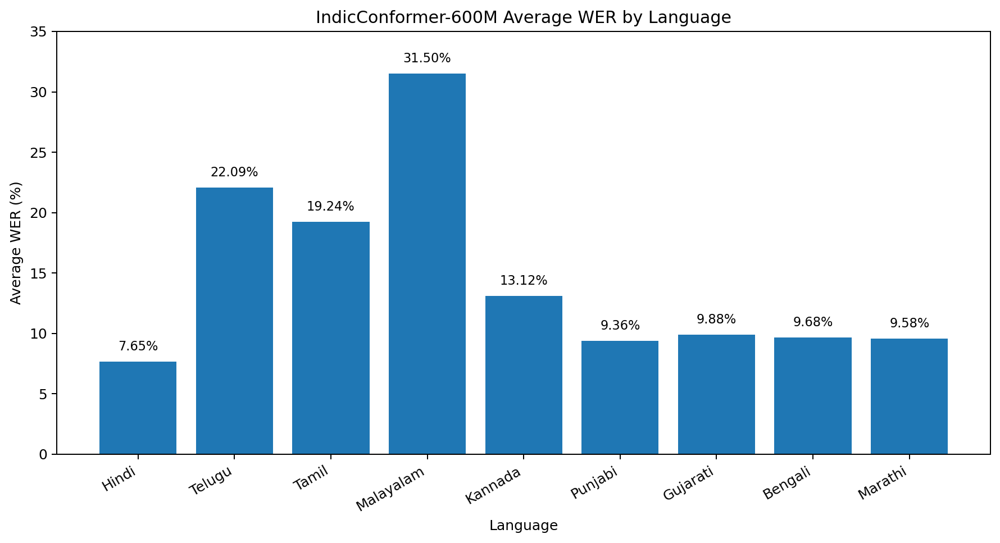

# IndicConformer ASR Benchmark

Benchmarking **AI4Bharat IndicConformer-600M** for multilingual Automatic Speech Recognition (ASR) across **9 Indian languages using 900 audio samples** from the **Kathbath validation dataset**.

The benchmark evaluates **Word Error Rate (WER)** using **RNNT decoding** and compares inference behavior across **CPU and NVIDIA T4 GPU** environments.

### Key Highlights

- **Model:** AI4Bharat IndicConformer-600M
- **Dataset:** AI4Bharat Kathbath (`valid` split)
- **Languages:** 9 Indian languages
- **Samples:** 900 audio samples (100 per language)
- **Decoding:** RNNT
- **Evaluation Metric:** Word Error Rate (WER)
- **Hardware:** Google Colab CPU and NVIDIA T4 GPU

### Benchmark Results

| Language | Samples | Average WER |
|---|---:|---:|
| Hindi | 100 | 7.65% |
| Telugu | 100 | 22.09% |
| Tamil | 100 | 19.24% |
| Malayalam | 100 | 31.50% |
| Kannada | 100 | 13.12% |
| Punjabi | 100 | 9.36% |
| Gujarati | 100 | 9.88% |
| Bengali | 100 | 9.68% |
| Marathi | 100 | 9.58% |

## Architecture

The benchmark follows a simple evaluation pipeline from audio preprocessing through ASR inference and WER calculation.

**Best average WER:** Hindi — **7.65%**  
**Highest average WER:** Malayalam — **31.50%**

> **Note:** This is a lightweight benchmark using 100 validation samples per language. The results should be treated as an initial evaluation rather than a definitive assessment of IndicConformer's overall performance.

---

## Why I Built This

Automatic Speech Recognition for Indian languages is an interesting engineering problem because speech recognition performance can vary significantly between languages, speakers, accents, and audio conditions.

I wanted to build a small, reproducible benchmark rather than simply running an ASR model and looking at a few transcriptions.

This project focuses on:

- Running IndicConformer inference
- Evaluating multiple Indian languages
- Measuring Word Error Rate (WER)
- Comparing CPU and GPU inference
- Saving reproducible benchmark results
- Understanding where the model performs well and where it struggles

The benchmark was developed using Google Colab because the available local hardware was not sufficient for running the 600M-parameter model efficiently.

---

## Model

### AI4Bharat IndicConformer-600M-Multi

Model:

`ai4bharat/indic-conformer-600m-multilingual`

IndicConformer is a multilingual Conformer-based ASR model developed by AI4Bharat.

The model supports speech recognition across 22 officially recognized Indian languages and provides both CTC and RNNT decoding strategies.

For this benchmark, I used the **RNNT decoding mode**.

The model contains approximately **600 million parameters**.

Model repository:

https://huggingface.co/ai4bharat/indic-conformer-600m-multilingual

---

## Dataset

### AI4Bharat Kathbath

Dataset:

`ai4bharat/kathbath`

Kathbath is a multilingual speech dataset designed for Indian languages.

For this benchmark, I used the **validation (`valid`) split** and selected 100 samples for each language.

This was intentionally designed as a lightweight benchmark so that the complete experiment could be run using Google Colab resources.

Dataset:

https://huggingface.co/datasets/ai4bharat/kathbath

---

## Languages Evaluated

The benchmark currently covers 9 Indian languages:

| Language | Code |
|---|---|
| Hindi | hi |
| Telugu | te |
| Tamil | ta |
| Malayalam | ml |
| Kannada | kn |
| Punjabi | pa |
| Gujarati | gu |
| Bengali | bn |
| Marathi | mr |

Total:

**9 languages × 100 samples = 900 audio samples**

---

## Evaluation Metric

### Word Error Rate (WER)

The primary evaluation metric used in this project is **Word Error Rate (WER)**.

WER measures the difference between the reference transcription and the model's predicted transcription.

It is calculated using:

WER = (Substitutions + Deletions + Insertions) / Number of words in reference

---

## Audio Processing

Before sending audio to IndicConformer, each audio sample goes through a small preprocessing pipeline.

The preprocessing steps are:

1. Load the audio using `torchaudio`
2. Convert multi-channel audio to mono
3. Check the sampling rate
4. Resample the audio to 16 kHz when required
5. Pass the processed waveform to IndicConformer for inference

The pipeline can be summarized as:

Kathbath Audio
      ↓
Load Audio
      ↓
Convert to Mono
      ↓
Check Sample Rate
      ↓
Resample to 16 kHz
      ↓
IndicConformer
      ↓
RNNT Decoding
      ↓
Predicted Transcription

---

## Benchmark Methodology

For each language, 100 samples were selected from the Kathbath validation split.

The same evaluation process was applied to every language to keep the benchmark consistent.

For each audio sample:

1. Load the ground-truth transcription
2. Load the corresponding audio
3. Preprocess the audio
4. Run IndicConformer using RNNT decoding
5. Generate the predicted transcription
6. Calculate WER between the reference and prediction
7. Store the individual result

After processing all samples for a language, the individual WER values are averaged to produce the language-level benchmark result.

---

## Results

The benchmark was run on 9 Indian languages with 100 validation samples per language.

| Language | Samples | Average WER |
| -------- | ------- | ----------- |
| Hindi | 100 | 7.65% |
| Telugu | 100 | 22.09% |
| Tamil | 100 | 19.24% |
| Malayalam | 100 | 31.50% |
| Kannada | 100 | 13.12% |
| Punjabi | 100 | 9.36% |
| Gujarati | 100 | 9.88% |
| Bengali | 100 | 9.68% |
| Marathi | 100 | 9.58% |

Lower WER indicates better ASR performance.

### WER Comparison

### Observations

- **Hindi achieved the lowest average WER (7.65%)** among the evaluated languages.
- **Malayalam had the highest average WER (31.50%)** in this benchmark.
- Telugu (22.09%) and Tamil (19.24%) also showed noticeably higher WER compared with Hindi and several other evaluated languages.
- Punjabi, Gujarati, Bengali and Marathi produced relatively lower WER values in this evaluation.
- These differences show that ASR performance can vary substantially across languages even when the same multilingual model and evaluation procedure are used.
- The results should not be interpreted as a definitive language ranking because the benchmark uses only 100 validation samples per language.

In this benchmark, Hindi produced the lowest average WER, while Malayalam produced the highest average WER among the evaluated languages.

These results should be treated as an initial benchmark rather than a definitive evaluation of IndicConformer because only 100 samples were evaluated per language.

---

## CPU vs GPU Inference

The benchmark was executed in Google Colab using both CPU and NVIDIA T4 GPU environments.

The NVIDIA T4 GPU showed noticeably lower inference latency than CPU execution for the benchmark workload, demonstrating the practical benefit of hardware acceleration for a 600M-parameter ASR model.

### What this comparison shows

- GPU acceleration can significantly reduce inference latency for the same ASR model.
- A 600M-parameter model can be computationally demanding for CPU inference.
- Inference performance depends on both model size and available hardware.
- GPU measurements are useful when considering future deployment and serving optimizations.

> **Important:** These measurements were collected using Google Colab and should not be treated as universal hardware benchmarks. Runtime performance can vary based on CPU/GPU availability, audio duration, model initialization, and system load.

---

## Limitations

This benchmark is intentionally small and should be considered a baseline evaluation rather than a comprehensive assessment of IndicConformer's performance.

### 1. Limited Evaluation Size

Only 100 samples were evaluated for each language, giving a total of 900 audio samples.

A larger and more diverse evaluation set would provide more reliable estimates of language-level performance.

### 2. Limited Language Coverage

IndicConformer supports 22 Indian languages, while this benchmark evaluates only 9 languages:

- Hindi
- Telugu
- Tamil
- Malayalam
- Kannada
- Punjabi
- Gujarati
- Bengali
- Marathi

The current results therefore do not represent the model's performance across all supported languages.

### 3. Validation Split

The experiment uses the Kathbath `valid` split and is not intended to reproduce the official evaluation methodology used by the model authors.

The benchmark is designed primarily for a consistent, lightweight comparison across the selected languages.

### 4. Limited Error Analysis

The current evaluation focuses primarily on overall Word Error Rate (WER).

It does not yet provide detailed analysis of:

- Substitutions
- Deletions
- Insertions
- Accents
- Background noise
- Speaker characteristics
- Speaking rate

Breaking WER into these error categories would provide better insight into where recognition errors occur.

### 5. Text Normalization

WER can be affected by punctuation, whitespace, Unicode representation, and language-specific text normalization.

More rigorous language-aware normalization would make cross-language comparisons more reliable.

### 6. Hardware and Latency Variability

CPU and NVIDIA T4 measurements were collected using Google Colab.

Inference latency can vary depending on:

- Available hardware
- Audio duration
- Model initialization
- Runtime conditions
- System load

Therefore, the current latency observations should not be treated as universal hardware benchmarks.

### 7. Noisy and Code-Switched Speech

The current benchmark does not specifically evaluate:

- Noisy speech
- Code-switched speech
- Long-form conversational speech

These conditions would be important for evaluating robustness in more realistic deployment scenarios.

> **Overall:** The current benchmark is best viewed as a reproducible baseline for comparing IndicConformer performance across a selected set of Indian languages, rather than as a definitive model evaluation.

---

## What I Would Improve

If I continue developing this benchmark, I would focus on the following improvements:

- Increase the evaluation set from 100 samples to 500–1,000+ samples per language
- Evaluate all 22 languages supported by IndicConformer
- Implement more robust language-specific text normalization
- Perform detailed substitution, deletion, and insertion analysis
- Compare IndicConformer with other ASR models using the same dataset
- Measure inference latency more systematically
- Measure throughput and memory usage
- Evaluate long-form and noisy speech
- Explore batch inference and real-time inference
- Investigate model optimization and quantization

---

## Reproducibility

The repository contains:

- The complete Google Colab notebook
- `requirements.txt`
- Benchmark summary CSV
- Sample-level benchmark details CSV
- Screenshots of the benchmark execution
- This documentation

The experiment uses publicly available models and datasets.

No Hugging Face access token or other credentials are stored in this repository.

The notebook can be opened in Google Colab and executed using a Hugging Face account with access to the IndicConformer model.

---

## Future Work

The next stage of this project could extend the benchmark into a more comprehensive multilingual ASR evaluation framework.

Possible directions include:

- Benchmarking all 22 supported Indic languages
- Comparing multiple ASR models
- Larger evaluation datasets
- Detailed ASR error analysis
- Real-time inference benchmarking
- GPU/CPU throughput comparison
- Long-form speech evaluation
- Noisy speech evaluation
- Model optimization and deployment

---

## Author

**Mohan**

GitHub: [Mohanaspiringcoder](https://github.com/Mohanaspiringcoder)
